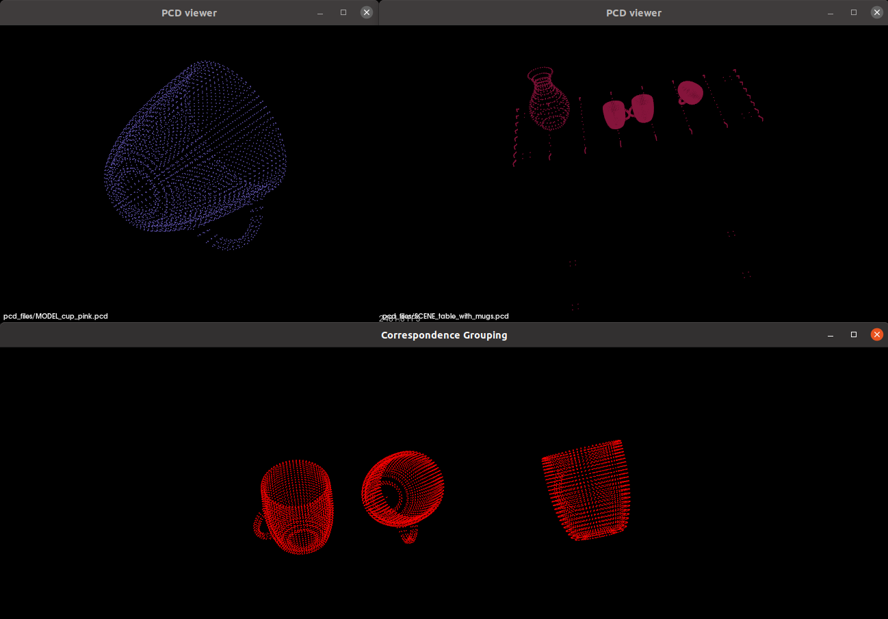

# PointCloud matching
The goal of this project is to take 2 different point clouds (model and scene),
and get the position(s) of model(s) (and their transformations) in scene if there is any.

My goal is to compare different methods with this program.

I started with PCL tutorial, which was fine for test dataset.

Correspondece grouping between mug model and table scene with 3 mugs:
 MODEL_cup_pink.pcd + SCENE_table_with_mugs.pcd = all models in scenes

This project is WIP. To change the methods, you have to edit the main() method and build it. (Sorry for that)
## Functions:
This project can:
- load cloud from PCD or PGM file, and save PCD file
- find normals
- find keypoints
  - subsampling
  - SIFT
  - Harris w/ options
- create descriptors for keypoints
  - FPFH
  - SHOT
     
Harris options:

1. HARRIS 
2. NOBLE
3. LOWE
4. TOMASI
5. CURVATURE
## Ubuntu env:
Download PCL: https://pointclouds.org/downloads/

### To run this project in terminal:
1. Go to the `/build` folder.
2. `cmake ..`
3. `make`
4. `./main.cpp`

### Data
In `/pcd_files` directory you can find models with `MODEL_cup_` prefix (mug), and scenes with `SCENE_table_` prefix (table with mugs).

In `/pcd_real_scenes` directory you can clouds from PGM files. In `/pcd_valve_resized` there are valve models in scale 1:1 to scenes.

Warning: Normals for real scenes takes up to 3 hours on my new Legion laptop. Don't even try to compute keypoints without compiling the PCL to use graphic card.

To view the .pcd files in Ubuntu `pcl_viewer -multiview 1 <pcd_filepath>`
